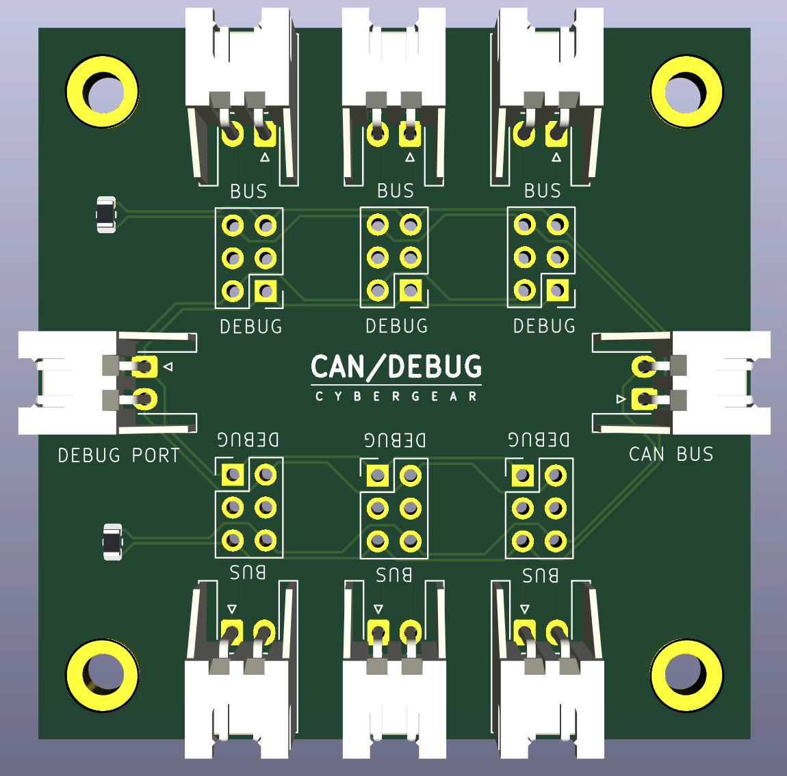
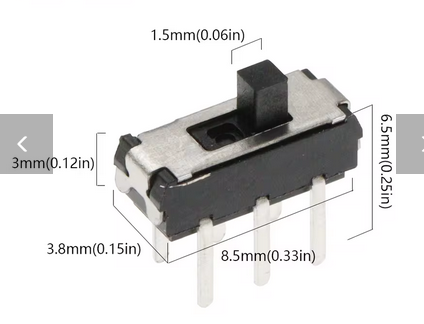
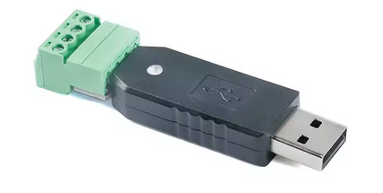

# CyberGear CAN-Bus PCB

[](https://opensource.org/licenses/MIT)
[](https://github.com/cybergear-robotics/cybergear-canbus-pcb/activity)

This is a small extension board located on the CyberBot. It distributes the
CAN-bus to all 6 cybergears and provides a debug port. Each cybergear CAN-bus sink can
be switched between CAN-bus or debug port. The can-bus is designed as star
topology, which works in small setups. 



## DIP switches

The switches are missing in the production files and you need to solder these on your
own. The required switches are MSS22D18 Mini DIP Slide Switch 2x03.



## Debug Port

The debug port is connected to a special CAN to USB adapter. There is no product
number. I only could find one offer on Aliexpress for around 12 euros:

```
USB-TTL/RS232/RS485/CAN Serial Communication Module CH340 CP2102 Data Conversion
Transparent Transmission Standard Protocol
```




